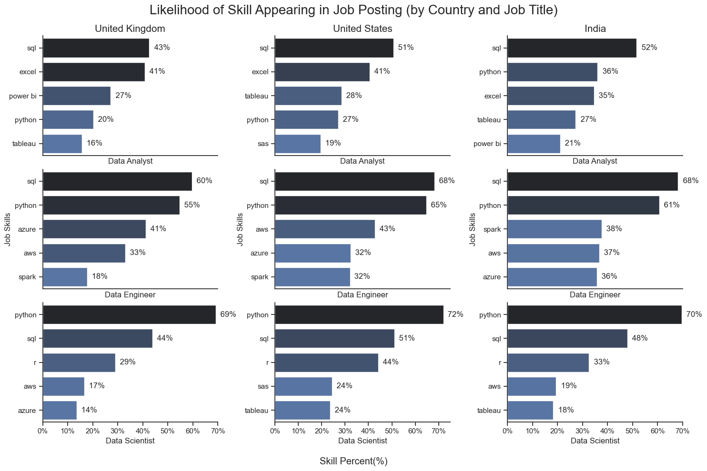
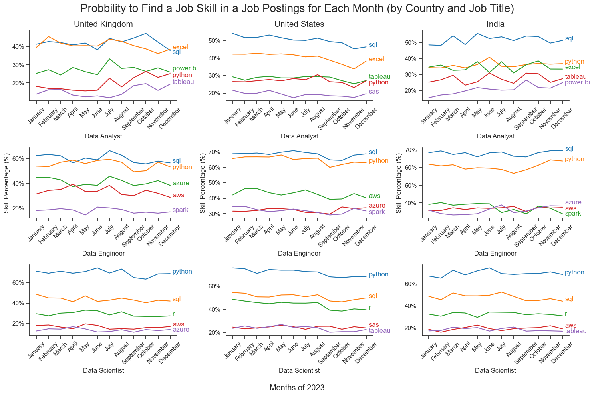
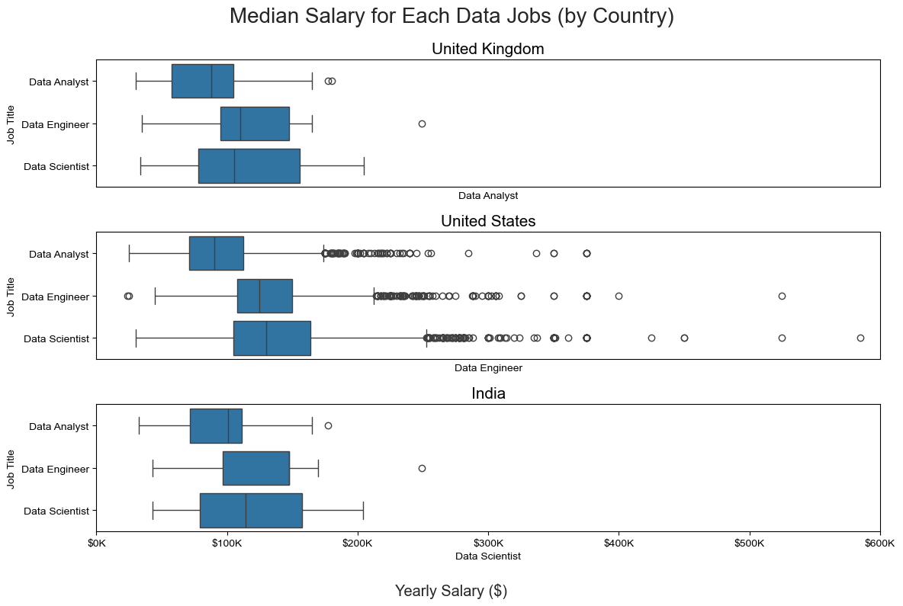
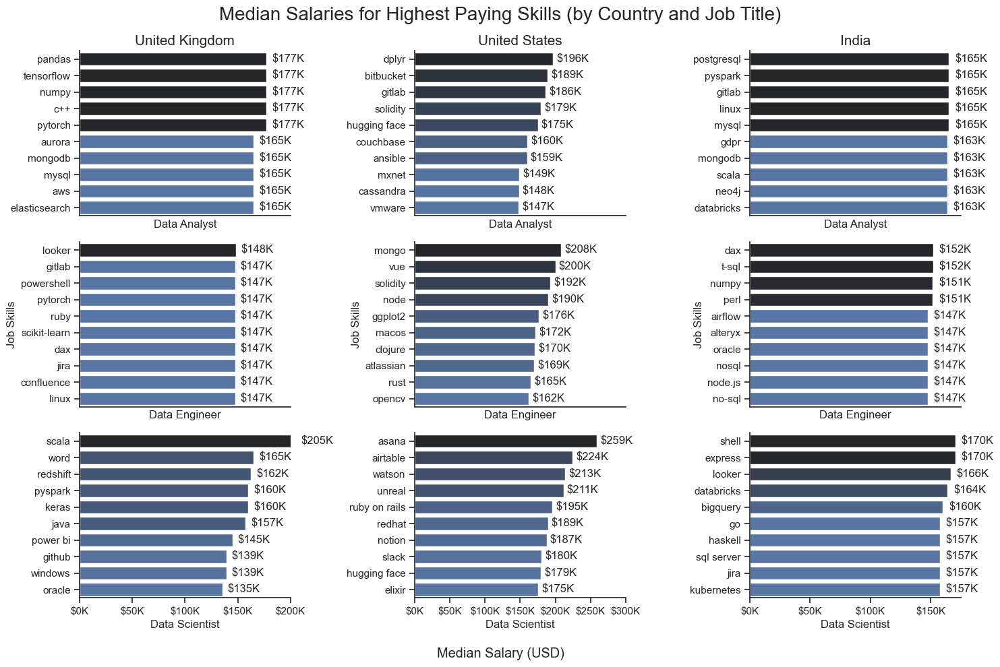
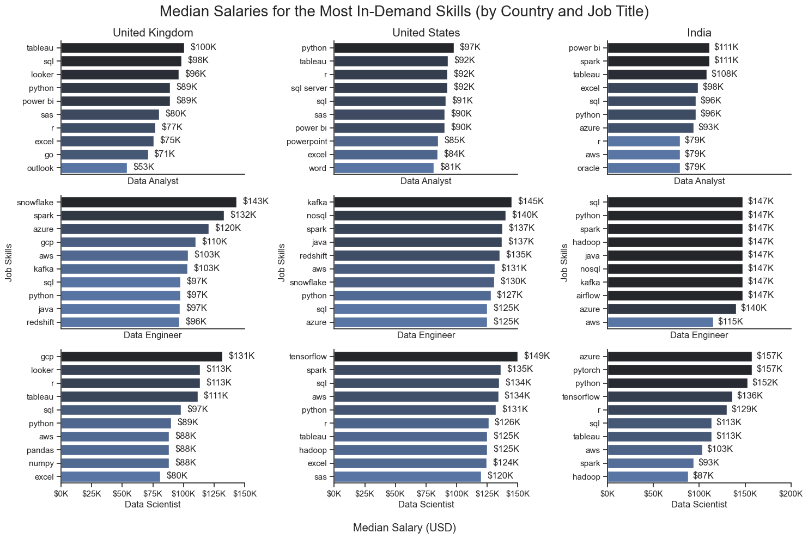
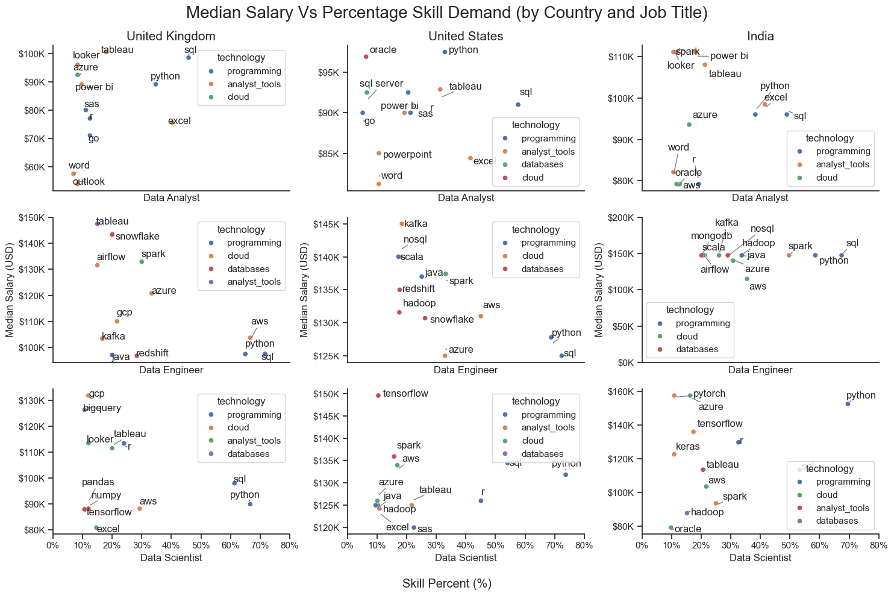

# Overview

This project was inspired by the Luke Barousse Tutorial on Python for Data Analytics. In my personal bid to leave Scrum Mastering and get back into Data Analytics, this project resonated with me on a personal level, allowing me to understand and navigate the data job market more effectively. This project delves into the top-paying and most in-demand skills to help find where I should focus my efforts when up-skilling, as well as to find the most optimal job opportunities for Data Analysts. 

One of the amendments that will be made from the original project is the breadth of exploration. Whilst the original project specifically focussed on Data Analyst jobs in the United States, this project will increase the scope, focussing on the following areas: 
- Roles: 
  - Data Analyst
  - Data Engineer
  - Data Scientist
- Countries: 
  - United Kingdom
  - United States
  - India

# The Questions

The following questions will be explored in this project:

1. Which skills have the highest likelihood of appearing on a job posting (most in-demand)?
2. Which skills are most likely to appear on a job posting in any given month (skills most trending)?
3. How well do jobs and skills pay?
4. What are the most optimal skills to learn (most in-demand and highest paying)?

# Tools Utilised

Several key tools were utilised to carry out the analysis / exploration on the job market data:

- **Python**: Allowed for effective analysis of the data, as well as the identification of various key insights. To supplement this, various libraries were imported:

  - **Pandas Library**: Used to analyse the data
  - **Matplotlib Library**: Used to visualise the data
  - **Seaborn Library**: Used to create more advanced visuals

- **Jupyter Notebooks**: Facilitates the convenience of running both Python scripts and Markdowns simultaneously, enabling the creation of clear and concise documents containing both.
- **Visual Studio Code**: My preferred user friendly IDE for executing Python scripts.

- **Git & Github**: Essential for version control and sharing Python code and analysis, ensuring collaboration and project tracking.

# Data Preparation and Clean-Up

This section outlines the steps taken to prepare the data for analysis, ensuring accuracy and usability

## Import & Clean-Up Data

We begin with importing the necessary libraries and loading the dataset, followed by initial data cleaning tasks to ensure data quality.

``` Python
# Importing Libraries
import ast
import pandas as pd
from datasets import load_dataset
import matplotlib.pyplot as plt
from matplotlib.ticker import PercentFormatter
import seaborn as sns

# Loading Data
dataset = load_dataset('lukebarousse/data_jobs')
df = dataset['train'].to_pandas()

# Data Cleanup
df['job_posted_date'] = pd.to_datetime(df['job_posted_date'])
df['job_skills'] = df['job_skills'].apply(lambda x: ast.literal_eval(x) if pd.notna(x) else x)
```

## Filter for US Jobs

As mentioned previously, this project will increase the scope compared to the original Luke Barousse Project, focussing on the following areas: 
- Roles: 
  - Data Analyst
  - Data Engineer
  - Data Scientist
- Countries: 
  - United Kingdom
  - United States
  - India

The below code demonstrates the creation of two lists, containing the job titles and countries (respectively) that are of interest to us. These lists are utilised to filter the original dataset, so that only data pertaining to the items in the lists are shown:

``` Python
# List Containing Job Roles: Data Analyst, Data Engineer, Data Science
job_titles = ['Data Analyst', 'Data Engineer', 'Data Scientist']

# List Containing Countries: United Kingdom, United States, India
countries = ['United Kingdom', 'United States', 'India']

# Filter the Dataset for Job Roles and Countries
df_job_ctry = df[(df['job_title_short'].isin(job_titles)) & (df['job_country'].isin(countries))]
```
# The Analysis

Each Jupyter notebook in this project investigates a specific aspect of the data job market. The specific analysis / approach will be explained in this section for each notebook:

## Which Skills Have the Highest Likelihood of Appearing on a Job Posting (Most In-Demand Skills)?

### Method

To find the skills with the highest likelihood of appearing in a job posting, the following steps were necessary:
1. Clean the skill column and create a table exploring the skill count of job postings
2. Create a visualisation demonstrating the skill count of job postings
3. Calculate the percentage likelihood of a skill appearing on a job posting
4. Create a graph showing the percentage likelihood of a skill appearing on a job postings

**View Corresponding Notebook with Detailed Steps Here**: [2_Skills_Demand.ipynb](2_Skills_Demand.ipynb)

### Key Code Supporting Method

Further filters were necessary when working with the job_skills column. In the original dataset, the skills are in list format for each row (e.g. one row may have the following list value '['python', 'tableau', 'sql']'), thus they needed to be exploded so the resultant skills could be worked with e.g. obtaining counts. When a row is exploded, it means the row is duplicated for each item in the list (e.g. take the original example of a row having value ['python', 'tableau', 'sql'] in job_skills column. This means three copies will be made of the original row, one with 'python' in the job_skills column, another with 'tableau' and another with 'sql').

```python
# Explode the Job Skills Column
df_skills = df_job_ctry.explode('job_skills')
```

The below code shows:
- The creation of the original table, which calculates the count of each job skill (how many times a particular skill appears in all job postings)
- The creation of a second table using nested for loops, calculating the total number of job postings for each country and job title combination (e.g. Data Analyst Roles in India had 6121 job postings)
- The eventual merger of the above two tables, so the total number of times a skill appeared in job postings, and the total number of job postings could be in the same table, leading to the eventual skill percent calculation

```python
# Create a Table Exploring the Skill Count of Job Postings Using Groupby()
df_skills_count = df_skills.groupby(['job_country', 'job_title_short', 'job_skills']).size()

# Create Loop to Obtain List of Job Totals (Refer to Pre-Exploded Df to Get No. of Job Postings)
jobs_total = []
for i, job_title in enumerate(job_titles):
    for j, country in enumerate(countries):
        df_sum = df_job_ctry[(df_job_ctry['job_country'] == country) & (df_job_ctry['job_title_short'] == job_title)]
        df_sum = df_sum.shape[0]
        jobs_total.append({'job_title_short': job_title,
                           'job_country': country,
                           'jobs_total': df_sum})

# Merge Jobs Total and Skills Count Table Together
df_skills_perc = pd.merge(df_skills_count, df_jobs_total, how = 'left', on = ['job_title_short', 'job_country'])
```

The below code refers to the barplot that shows which skills have the highest percentage likelihood of being on a job posting.

```python
# Setup Figure
fig, ax = plt.subplots(len(job_titles), len(countries), figsize = (15, 10))

# Set Theme Using Seaborn
sns.set_theme(style = 'ticks')

# Will Loop Through Lists (Job Titles & Countries) a Bit Like V-Lookup
for i, job_title in enumerate(job_titles):
    for j, country in enumerate(countries):

# Filters and Orders the Skills Count Table Using the Loop to Adjust the Filters Accordingly 
        df_plot = df_skills_perc[(df_skills_perc['job_country'] == country) & (df_skills_perc['job_title_short'] == job_title)]
        df_plot = df_plot.sort_values(by = 'skill_count', ascending = False).head(5)

# Creation of the Chart Using Seaborn
        sns.barplot(
        data = df_plot,
        x = 'skill_percent',
        y = 'job_skills',
        ax = ax[i, j],
        hue = 'skill_percent',
        palette = 'dark:b_r',
        legend = False
    )
```
### Visualisation

Bar graph showing the likelihood of a skill appearing in a given job posting, dependent on the country the job is in, as well as the data role.



### Insights

- No matter which country, SQL has the highest likelihood of appearing in a job posting for both a Data Analyst (avg 48% chance) and Data Engineering role (avg 65% chance), and the second highest likelihood of appearing for a Data Scientist role (avg 47% chance).

- Interestingly enough, even though SQL is only the second most likely skill to be requested for a Data Scientist, it is still equally as likely to find it as a skill for Data Analysts, despite it having the highest likelihood of all three countries. It is over around 15% more likely to be found in a job posting for Data Engineers.

- In all three countries, Python has the highest likelihood of appearing in a job posting for Data Scientists (avg 71% chance), and the second highest likelihood for Data Engineers (avg 65% chance). Python has the highest likelihood of any other skill with regard to Data Science in the United States, and is almost 20% more likely to see on a Data Science role that the second most likely SQL (avg chance 47%).

- Whilst Python is the second most likely to see in a Data Analyst job posting in India (36% chance), it is only the fourth most likely in both the United Kingdom (20% chance) and the United States (27% chance). For Data Analysts in the United Kingdom and United States, preference is given to Excel as the second most likely skill (41% chance for both countries)

- For Data Analysts in each country, they each promote data visualisation tools, with the UK giving preference to Power BI (27% chance), whilst the United States and India give preference to Tableau (28% chance). 

- For Data Engineers in each country, they promote the use of Azure (avg 36 % chance), Spark (avg 28% chance) and AWS (avg 37% chance) in any which order as the final three most likely, demonstrating that Data Engineers are expected to be more proficient with more specialised technical skills (e.g. Azure, Spark, AWS), as opposed to Data Analysts, who utilise more general data management and analysis tools (e.g. Excel, Power BI, Tableau)

- In the Data Science World, for all three countries, R is the third most likely skill to see on a job posting (avg 35% chance), which makes sense as R can be used effectively when applying machine learning (e.g. random forest, k-means clustering etc.)

## Which Skills Are Most Likely to Appear on a Job Posting in any Given Month (Skills Most Trending)?

### Method

To find which skills are most likely to appear on a job posting in any given month the following steps were necessary:
1. Clean the skill column and create a table exploring the skill count of job postings monthly
2. Plot the count of job skills for each month
3. Calculate the probability to find a particular skill in a job posting for any given month
4. Plot the probability to find a job skill in a job posting for any given month

View Corresponding Notebook with Detailed Steps Here: [3_Skills_Trend.ipynb](3_Skills_Trend.ipynb)

### Key Code Supporting Method

The below code shows the creation of a pivot table to show the count of each job skill for any given month (how many times a particular skill appears in all job postings for a given month).

```python
# Create Pivot Table to Show the Count of Each Job Skill for Any Given Month
df_job_ctry_piv = df_job_ctry_exp.pivot_table(
    index = ['job_country', 'job_title_short', 'job_posted_month'], 
    columns = 'job_skills', 
    aggfunc = 'size', 
    fill_value = 0
    )
```

Similar to the previous section, nested for loops are utilised to obtain the total number of job postings for each country and job title combination, however, they also need to be split into months too (e.g. January Data Analyst Roles in India had 628 total job postings). Unlike last time, we must explode the lists in the resultant table to get a table that can be merged with the original, much like the previous section.

```python
# Create Loop to Obtain List of Job Totals (Refer to Pre-Exploded Df to Get No. of Job Postings)
jobs_total = []
for i, job_title in enumerate(job_titles):
    for j, country in enumerate(countries):
        df_sum = df_job_ctry[(df_job_ctry['job_country'] == country) & (df_job_ctry['job_title_short'] == job_title)]
        df_sum = df_sum['job_posted_month'].value_counts()
        jobs_total.append({'job_title_short': job_title,
                           'job_country': country,
                           'job_posted_month' : df_sum.index.tolist(),
                           'jobs_total_month': df_sum.values.tolist()})

# Create a DataFrame from the Results
df_jobs_total = pd.DataFrame(jobs_total)

# Explode the Lists
df_jobs_total = df_jobs_total.explode(['job_posted_month', 'jobs_total_month'])

```
The below code refers to a line plot that shows which skills have the highest percentage likelihood of being on a job posting for any given month.

```python
# Setup Figure
fig, ax = plt.subplots(len(job_titles), len(countries), figsize = (15, 10))

# Set Theme Using Seaborn
sns.set_theme(style = 'ticks')

# Will Loop Through Lists (Job Titles & Countries) a Bit Like V-Lookup
for i, job_title in enumerate(job_titles):
    for j, country in enumerate(countries):

# Filters and Orders the Skills Count Table Using the Loop to Adjust the Filters Accordingly 
        df_plot = df_skills_perc[(df_skills_perc['job_country'] == country) & (df_skills_perc['job_title_short'] == job_title)]
        df_plot.loc['Total'] = df_plot.sum()
        df_plot = df_plot.reindex(columns = df_plot.loc['Total'].apply(pd.to_numeric, errors='coerce').sort_values(ascending=False).index)
        df_plot = df_plot.drop('Total')
        df_plot = df_plot.iloc[:, 0:5]

# Creation of the Chart Using Seaborn        
        sns.lineplot(
             data = df_plot,
             ax = ax[i, j],
             dashes = False,
             palette = 'tab10',
             legend = False
             )
```

### Visualisation

Line graph showing the likelihood of a skill appearing in a given job posting, dependent on the country the job is in, as well as the data role for any given month.



### Insights

- For all countries and job titles, the trend for each job skill is relatively flat. Whilst there are small increases and decreases in percentage for each skill over the months, I would go as far to say that these changes are negligible in the overall picture, thus more useful insights can be gathered in the previous section. 

- The Data Analyst charts in the United Kingdom and India have the most volatile charts with changes around 1% to 4% in each skill over the months. 

## How Well do Data Jobs and Skills Pay?

### Method

There are two parts to this section:
- How well do the chosen data jobs pay in each of the specified countries?
1. Create a table displaying the median salary
2. Create a chart displaying the median salaries 
- Which skills pay the most for in each data job and country specified previously?
1. Find median salary per skill for all data jobs
2. Obtain tables for the highest paying / most in-demand skills (Top 10)
3. Create charts for the highest paying / most in-demand skills (Top 10)

View Corresponding Notebook with Detailed Steps Here: [4_Salary_Analysis.ipynb](4_Salary_Analysis.ipynb)

### Key Code Supporting Method

The below code refers to a boxplot that compares the median salaries (USD) of each data job across each chosen country.

```python
# Setup Figure
fig, ax = plt.subplots(len(countries), 1, figsize = (12, 8))

# Set Theme Using Seaborn
sns.set_theme(style = 'ticks')

# Will Loop Through Lists (Job Titles & Countries) a Bit Like V-Lookup
for i, country in enumerate(countries):

# Filters and Orders the Skills Count Table Using the Loop to Adjust the Filters Accordingly 
    df_plot = df_job_ctry[df_job_ctry['job_country'] == country]

# Creation of the Chart Using Seaborn 
    sns.boxplot(data = df_plot,
                x = 'salary_year_avg',
                y = 'job_title_short', 
                ax = ax[i],
                order = job_titles
                )
```
The below code refers to a barplot that compares median salaries (USD) of the highest paying data skills.

```python
# Setup Figure
fig, ax = plt.subplots(len(job_titles), len(countries), figsize = (15, 10))

# Set Theme Using Seaborn
sns.set_theme(style = 'ticks')

# Will Loop Through Lists (Job Titles & Countries) a Bit Like V-Lookup
for i, job_title in enumerate(job_titles):
    for j, country in enumerate(countries):

# Filters and Orders the Skills Count Table Using the Loop to Adjust the Filters Accordingly 
        df_plot = df_med_sal[(df_med_sal['job_country'] == country) & (df_med_sal['job_title_short'] == job_title)]
        df_plot = df_plot.sort_values('median', ascending = False).head(10)

# Creation of the Chart Using Seaborn
        sns.barplot(
            data = df_plot,
            x = 'median',
            y = 'job_skills',
            ax = ax[i, j],
            hue = 'median',
            palette = 'dark:b_r',
            legend = False
    )
```

The below code refers to a barplot that compares median salaries (USD) of the most in demand data skills (from highest to lowest paying).

```python
# Setup Figure
fig, ax = plt.subplots(len(job_titles), len(countries), figsize = (15, 10))

# Set Theme Using Seaborn
sns.set_theme(style = 'ticks')

# Will Loop Through Lists (Job Titles & Countries) a Bit Like V-Lookup
for i, job_title in enumerate(job_titles):
    for j, country in enumerate(countries):

# Filters and Orders the Skills Count Table Using the Loop to Adjust the Filters Accordingly 
        df_plot = df_med_sal[(df_med_sal['job_country'] == country) & (df_med_sal['job_title_short'] == job_title)]        
        df_plot = df_plot.sort_values('count', ascending = False).head(10)
        df_plot = df_plot.sort_values('median', ascending = False)

# Creation of the Chart Using Seaborn
        sns.barplot(
            data = df_plot,
            x = 'median',
            y = 'job_skills',
            ax = ax[i, j],
            hue = 'median',
            palette = 'dark:b_r',
            legend = False
    )
```

### Visualisation

Boxplot showing the median salaries of each data job, dependent on the country the job is in.



Bar graph showing the median salaries for the highest paying data skills, dependent on the country the job is in, as well as the data role for any given month.



Bar graph showing the median salaries for the most in-demand data skills, dependent on the country the job is in, as well as the data role for any given month.



### Insights

Comparing median salaries across data jobs and countries:
- The Indian Data Engineer Role has the highest median salary of $147,500
- The United Kingdom Data Analyst Role has the lowest median salary of $87,750
- The UK and India have a higher median salary for their Data Engineers than their Data Scientists, however, it's the opposite for the United States
- Data Analysts have the lowest median salary in all three countries (highest to lowest India, United States, United Kingdom)
- The UK has the lowest median salary out of all three countries

Comparing the highest paid (middle chart) against the most in demand (bottom chart) data skills across data jobs and countries:
- The middle graph shows that specialised technical skills like Dyplr, Bitbucket, Gitlab, Tensorflow, Mongo, Scala, Postgresql and Asana are associated with higher salaries, some reaching up to $200K, regardless of the country or data job. This suggests that advanced technical proficiency can increase earning potential.
- The bottom graph highlights that foundational skills like Excel, PowerPoint, and SQL are the most in-demand, even though they may not offer the highest salaries. This demonstrated the importance of these core skills for employability in all data roles.
- There's a clear distinction between skills that are highest paid and those that are most in-demand.
- If one were consider a middle ground, whilst the core skills must be learned e.g. SQL, Python, Tableau, it might be prudent to learn the most in demand highest paying skills e.g. Spark, Snowflake, Kafka, GCP, Tensorflow, Azure, Pytorch etc.

## What Are the Most Optimal Skills to Learn (Most In-Demand and Highest Paying)?

### Method

To find the most optimal skills to learn for any data position in any country, the following steps were taken:
1. Create a table displaying the median salaries of each skill
2. Find the likelihood of seeing a specific skill in a given job posting
3. Visualise median salary Vs percentage skill demand
4. Determine if certain technologies are more prevalent than others and visualise

View Corresponding Notebook with Detailed Steps Here: [5_Optimal_Skills.ipynb](5_Optimal_Skills.ipynb)

### Key Code Supporting Method

The code for visualising the most in-demand and highest paying skills can be lifted from the previous sections. The most in-demand skills median salaries were taken the same way as the salary analysis section, obtaining the count of how often each job appears in a job posting and obtaining their median salaries. The percentage chances were taken by dividing the counts by the total job count for each country and data job, previously done in the skills demand section.

The below code refers to a scatter plot, comparing the skill percentage of a job skill against the median salaries (USD).

```python
# Setup Figure
fig, ax = plt.subplots(len(job_titles), len(countries), figsize = (15, 10))

# Set Theme Using Seaborn
sns.set_theme(style = 'ticks')

# Will Loop Through Lists (Job Titles & Countries) a Bit Like V-Lookup
for i, job_title in enumerate(job_titles):
    for j, country in enumerate(countries):

# Filters and Orders the Skills Count Table Using the Loop to Adjust the Filters Accordingly 
        df_plot = df_tech_perc_merge[(df_tech_perc_merge['job_country'] == country) & (df_tech_perc_merge['job_title_short'] == job_title)]
        df_plot = df_plot.sort_values(by = 'skill_count', ascending = False).head(12)

# Creation of the Chart Using Seaborn
        sns.scatterplot(
            data = df_plot,
            x = 'skill_percent',
            y = 'median_salary',
            hue = 'technology',
            ax = ax[i, j]
            )
```

Scatter graph showing the percentage likelihood to see a data skill in a given job posting (top 12), against their corresponding median salaries, dependent on the country the job is in, as well as the data role for any given month.

### Visualisation



### Insights


- If we look at salaries alone, data skills pay up to a third more when a Data Engineer or Data Scientist needs them, when compared to a Data Analyst, even, in some cases, if the skills are the same e.g. in the UK, Data Analysts are paid $100k for Tableau use, however, data engineers are paid $150K. 
- Excluding these outliers, for the most part, the skills earning up to a third more for Data Engineers and Data Scientists are more technical and specialised in nature than those highest paying skills Data Analysts must know e.g. Snowflake, Spark, Airflow, GCP, Tensorflow, Pytorch etc.
- The majority of skills with the higher percentage likelihoods of being seen are often those core skills required that re-occurred in the previous sections e.g. Python, SQL, 
- The majority of technical analyst tools, though having a lower percentage likelihood, had larger salaries (e.g. Tableau, Oracle, Looker etc.), and the less technical analyst tools have a lower salary and likelihood (e.g. Word, Powerpoint), with the exception of Excel for Data Analysts, which is moderate for both areas.
- Cloud and database technologies tend to have a lower percentage likelihood, however, have some of the largest salaries e.g. GCP, Tensorflow, Pytorch etc.

# Overall Insights

### 1. Skill Importance by Role and Country

- **Data Analyst**:
  - **Most In-Demand Skills**: SQL (48% avg), Excel (41% UK & US), Tableau (28% US & India), Power BI (27% UK)
  - **Technical Skill Gap**: Python is not as prioritized for Data Analysts in the UK (20%) and US (27%) compared to India (36%).
  - **Salary Implication**: More generalist skills (SQL, Excel, Tableau, Power BI) lead to lower pay than specialised technical roles.
  - **Growth Path**: Moving toward technical skills like Spark, Snowflake, GCP, and Python could increase salary potential.

- **Data Engineer**:
  - **Most In-Demand Skills**: SQL (65%), Python (65%), Cloud Platforms (Azure 36%, AWS 37%), Spark (28%)
  - **Technical Expectation**: Proficiency in specialised tools such as Spark, Snowflake, Airflow, Kafka, and cloud technologies.
  - **Salary Implication**: The highest-paid data role in the UK and India, exceeding Data Scientists in those countries.
  - **Growth Path**: Focusing on advanced data processing frameworks and cloud technologies is key to increasing salary.

- **Data Scientist**:
  - **Most In-Demand Skills**: Python (71%), SQL (47%), R (35%)
  - **Technical Expectation**: Machine learning and AI-focused skills such as TensorFlow, PyTorch, and deep learning libraries.
  - **Salary Implication**: The highest-paid role in the US but second to Data Engineers in the UK and India.
  - **Growth Path**: Building expertise in machine learning and cloud-based AI services (GCP, Azure, AWS) can maximize earning potential.

### 2. Skill Demand vs. Salary Correlation

- **SQL Dominance**: Most in-demand skill across all roles but does not command the highest salary.
- **Python's Influence**: Essential for Data Scientists and Engineers, but not as crucial for Data Analysts in the UK and US.
- **Excel & Tableau/Power BI**: High demand for Data Analysts but relatively lower salaries compared to Data Engineering and Data Science roles.
- **Advanced Technical Skills**: Spark, Snowflake, Kafka, TensorFlow, and PyTorch command the highest salaries despite lower demand.

### 3. Market Trends and Salary Implications
- **Data Engineers Lead in Pay (UK & India)**: More technical focus on cloud and big data justifies the premium.
- **Data Scientists Earn More in the US**: Likely due to higher demand for AI and ML-focused roles.
- **Data Analysts Lag Behind in Salary**: Even if some skills like Tableau are well-paid, analysts generally earn less than engineers and scientists.
- **Cloud & AI Pay Premiums**: GCP, TensorFlow, and PyTorch offer top salaries despite being less common in job postings.

# Challenges Faced

This project was not without it's challenges, but it provided good learning opportunities:
- **Data Inconsistencies**: Handling missing or inconsistent data entires requires careful consideration and thorough data cleaning techniques to ensure the integrity of the analysis.
- **Complex Data Visualisation**: Designing effective visual representations of complex datasets was challenging when attempting to convey insights clearly and compellingly 
- **Balancing Breadth and Depth**: Deciding how deeply to dive into each analysis while maintaining a broad overview of the landscape required constant balancing to ensure comprehensive coverage without getting lost in details.

# Conclusion

### Strategic Learning Approach

1. **For Job Security**: Prioritize SQL, Python, and data visualization tools (e.g. Tableau, Power BI)
2. **For Higher Pay**: Move towards learning more specialised skills in Cloud Technology, Big Data and AI/ML
3. **For Long-Term Growth**:
    - **Data Analysts** → Transition into Data Engineering or Data Science.
    - **Data Engineers** → Master Cloud Technologies (e.g. AWS, Azure and GCP) as well as Big Data Technologies (e.g. Spark, Snowflake, Kafka, Airflow).
    - **Data Scientists** → Specialize in Machine Learning (e.g. TensorFlow, PyTorch), Cloud AI (e.g. GCP, Azure AI) and deep learning.